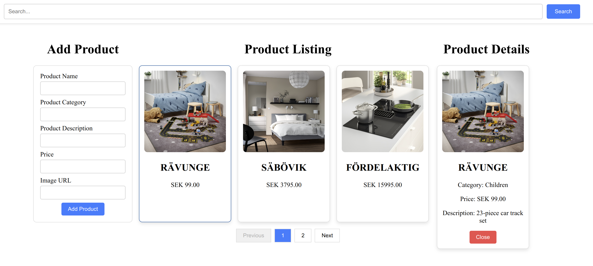
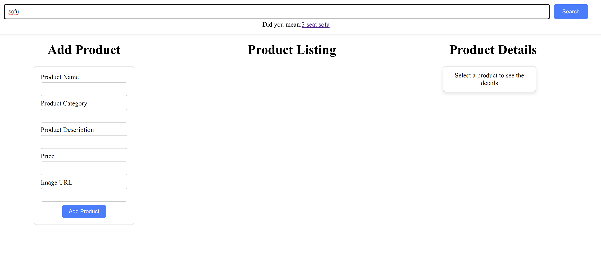
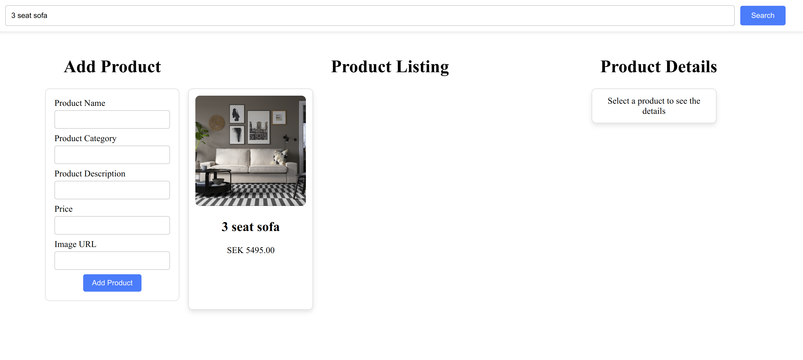

# Product

Demo application build on React. This application provides following features:

1. Add new product with required details 
2. List products with pagination
3. Show product details
4. Search product if not found suggested text shown to user so that new search query can be selected

# Prerequisites
1. Nodejs 20.15.0
2. NPM 10.8.1
3. product-api application should be running on localhost:8080

# Running the application locally

Go the application directory in terminal and run following commands
1. `npm install`

2. `npm run dev`

Once the application is up and running open the application in browser http://localhost:5173/

Application UI will look like following

